#                                              OS Lab1

####                                                  2312711 李浩桐    2314003 谭诗洋    2314081 王娇雪


## 一、练习1：理解内核启动中的程序入口操作

#### 1.`la sp,bootstacktop`指令分析

##### 完成的操作

- `la`:Load Address伪指令，将标签的地址加载到寄存器
- `sp`:Stack Pointer寄存器
- `bootstacktop`:内核栈顶部的地址标签

**实际执行** ：将bootstacktop的地址值加载到栈指针寄存器sp中

##### 目的和意义

- 为C代码运行准备栈环境，如果没有栈，C函数无法运行
- 建立内核的执行上下文，为后续中断处理，函数调用提供基础设施
- 满足RISC-V的调用约定，`bootstacktop`通过`.align PGSHIFT`确保页对齐(4KB边界)

#### 2.`tail kern_init` 指令分析

##### 完成的操作

- `tail`：尾调用伪指令，相当于直接跳转
- `kern_init`：C语言的主初始化函数

**实际执行** ：跳转到 kern_init，不保存返回地址

##### 目的和意义

- 从低级的汇编初始化代码跳转到高级的C语言主函数
- 尾调用优化避免了不必要的栈帧创建，内核初始化不会返回，不需要保存返回地址
- 体现操作系统的层次化设计

> 硬件层 → 引导层 → 内核汇编层 → 内核C语言层
>
> (BIOS)  (bootloader) (kern_entry) (kern_init)

```C++
#include <mmu.h>
#include <memlayout.h>

    .section .text,"ax",%progbits
    .globl kern_entry
kern_entry:
//当CPU执行到这时，内核代码已被加载到内存，但还处于“裸机状态”，缺乏运行高级语言代码的基本环境
    la sp, bootstacktop

    tail kern_init

.section .data
    # .align 2^12
    .align PGSHIFT
    .global bootstack
bootstack:
    .space KSTACKSIZE
    .global bootstacktop
bootstacktop:
```


## 二、练习2: 使用GDB验证启动流程

### （一）实验目的

本次实验旨在通过GDB调试工具实时跟踪QEMU模拟的RISC-V计算机系统从加电复位开始的完整启动过程，具体涵盖从CPU执行固件代码、OpenSBI初始化、引导加载程序运行到操作系统内核第一条指令执行的每个关键阶段，从而深入剖析RISC-V架构的硬件初始化序列、特权级转换机制以及系统软件交接流程，加深对计算机系统启动原理和RISC-V体系结构的理解。


### （二）实验环境

- 操作系统：Linux ubuntu
- 模拟器：QEMU（RISC-V架构）
- 调试器：GDB
- 目标系统：RISC-V 64位架构


### （三）实验步骤与观察结果

#### 1.实验环境的配置

##### **（1）工具的下载**

在我们的这个实验中，我们需要对所需的工具进行下载，所需的工具如下所示：

- git , make , gcc , tmux
- RISC-V 工具链——需要 riscv64-unknown-elf-gcc/ riscv64-unknown-elf-gdb 
- qemu-system-riscv64 
- 理解`RISC-V`架构指令集的`GDB`（已在工具链目录的`bin`文件夹里）

利用如下的代码即可：

```bash
sudo apt update
sudo apt install -y build-essential git make tmux gdb qemu-system-misc
```

除此以外，根据实验书提供的方法，我们可以很顺利地下载好模拟器 Qemu，通过指令`qemu-system-riscv64 --version`，我们可以确认Qemu 已经安装好，且版本在 4.1.0 以上，如下图所示:

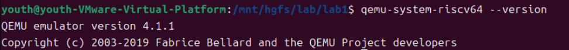

##### （2）源码的构建

对于该实验的复现过程，我们首先需要生成一个对应的镜像文件。

生成镜像文件是为了创建一个完整的可启动环境，它把内核代码、引导程序等组件按照计算机真实启动流程打包成一个模拟磁盘文件，这样我们的模拟器QEMU就能像真实计算机从硬盘启动一样加载和运行我们的操作系统。

**构建镜像文件的步骤如下所示：**

1. 将实验书中提供的代码导入虚拟机，并进入对应的~/lab1界面：


2. 清理构建环境：

为了确保从头开始编译，避免旧文件干扰，所以我们利用`make clean`命令删除了之前编译生成的所有目标文件、中间文件和可执行文件：

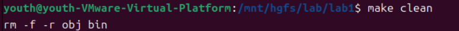

3. 构建项目：

而后，我们即可利用`make qemu`语句来进行我们镜像的创建，生成结果如下图所示：

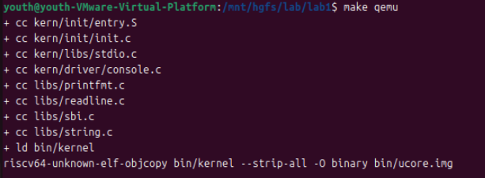

由上图可以看出，我们生成的文件主要有两个：

- `bin/kernel`：内核可执行文件
- `bin/ucore.img`：磁盘镜像文件

我们也可在对应的文件中找到我们生成的镜像文件与内核可执行文件：


**综上所述，我们的环境搭建成功，而后则可继续进行我们的实验！**


#### 2. 初始连接与复位地址检查

首先，在终端中执行以下命令启动QEMU运行内核，并设置为暂停等待GDB连接:

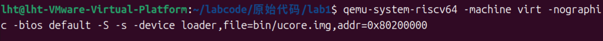

```Bash
qemu-system-riscv64 -machine virt -nographic -bios default -S -s -device loader,file=bin/ucore.img,addr=0x80200000
```

**分析** ：

- `-S`：让QEMU在启动后立即暂停，等待调试器连接
- `-s`：在本地的1234端口开启GDB服务器
- `-device loader,file=bin/ucore.img,addr=0x80200000`：指定加载的文件是bin目录下的ucore.img；并指定将镜像文件加载到内存地址0x80200000

接着我们可以打开另一个终端窗口，执行`make gdb`命令，此时，GDB即可自动加载内核符号并连接到QEMU，连接成功的结果如下图所示：

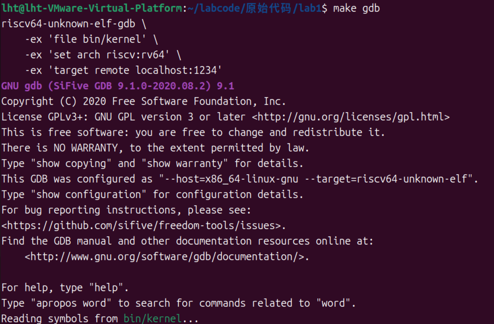

连接后，查看复位后的程序计数器值，结果发现PC指向了**地址0x1000**，这是RISC-V架构中规定的**复位向量地址**。说明QEMU 的复位向量在 0x1000（MROM）处，此时尚未进入 OpenSBI / 内核。

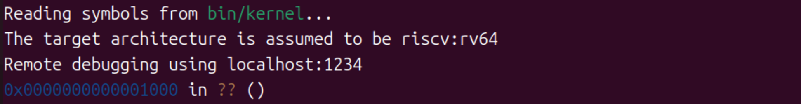

接着我们可以通过执行 `x/10i $pc` 命令查看接下来十条指令:

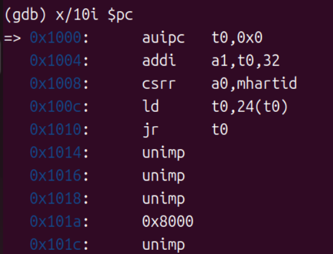

```Bash
0x1000: auipc   t0, 0x0
0x1004: addi    a1, t0, 32
0x1008: csrr    a0, mhartid
0x100c: ld      t0, 24(t0)
0x1010: jr      t0
0x1014: unimp
0x1016: unimp
0x1018: unimp
0x101a: 0x8000
0x101c: unimp
```

**分析：**

- `aufpc t0, 0x0`：将立即数左移12位后与当前PC相加`t0 = PC + (0 << 12)`，结果存入 `t0` 寄存器，用于计算基于当前 PC 的地址。
- `addt a1, t0, 32`：将t0的值加上32存入`a1`寄存器，用于设置后续操作的相关地址或参数。
- `csrr a0, mhartid`：读取当前硬件线程ID到`a0`寄存器，获取当前运行的硬件线程信息
- `ld t0, 24(t0)`：从`t0+24`的地址加载8字节数据到`t0`寄存器`t0 = [t0 + 24] = [0x1000 + 24] = [0x1018]，`获取到下一阶段要跳转的目标地址。
- `jr t0`：跳转到`t0`指向的地址，实现引导流程向下一阶段即OpenSBI的过渡。

由上述分析我们可以发现，我们的代码会在地址为` 0x1010 `地址的指令处发生跳转，故实际执行的指令仅为前五条指令。这些指令完成了最基本的硬件初始化操作，包括获取硬件线程ID和为跳转到下一引导阶段做准备。

而后我们还可以运用`info registers t0 a0 a1`来查看当前我们的这三个寄存器的值，我们可以发现，还没有执行时这三个寄存器的值均初始化为0。

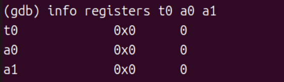

而后，我们可以利用单步执行命令`si`来观察汇编指令是如何一条条执行的：

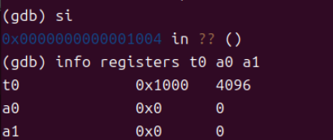

执行完这一步后，我们再利用`info registers t0 a0 a1`来查看当前我们的这三个寄存器的值，我们可以发现，第一条汇编指令成功执行，我们的`t0`寄存器存储的值为`0x1000`，即我们当前执行这条指令的地址。

紧接着，我们可以继续用`si`进行逐步的分析，得到的结果如下所示：

```bash
(gdb) si
0x0000000000001008 in ?? ()
(gdb) info registers t0 a0 a1
t0             0x1000        4096
a0             0x0        0
a1             0x1020        4128
(gdb) si
0x000000000000100c in ?? ()
(gdb) info registers t0 a0 a1
t0             0x1000        4096
a0             0x0        0
a1             0x1020        4128
(gdb) si
0x0000000000001010 in ?? ()
(gdb) info registers t0 a0 a1
t0             0x80000000        2147483648
a0             0x0        0
a1             0x1020        4128
```

通过这三步的单步分析，我们可以观察到`a1`寄存器中存储了我们后续需要用到的设备树的地址`0x1020`；当前硬件线程ID`a0=0`寄存器，说明我们是单核系统；而执行完` ld t0,24(t0)`后，我们的`t0 = 0x80000000`指向了OpenSBI 的入口点，而 t0 等于该值的主要原因是：首先RISC-V是小端序，较低地址存储数据的低位字节，其次我们的每个地址处存储两个字节的内容，所以当执行跳转指令后，我们会从地址 0x1018（即 0x1000+24）处读取一个64 位（8个字节）数据即0x0000000080000000，并将其加载到 t0 寄存器中。


#### 3. 设置0x80000000断点并分析

使用GDB调试时，我们首先使用`b *0x80000000`命令在地址`0x80000000`处设置断点，该位置是OpenSBI固件的入口点；接着我们则执行继续运行命令`c`，让程序从当前状态执行直至触发该断点，此时CPU会暂停在OpenSBI的入口处；最后，我们再通过反汇编命令`x/10i 0x80000000`来查看该地址起始的10条指令，以确认OpenSBI的初始代码。

此地址加载的是作为bootloader的`OpenSBI.bin`，其作用是初始化硬件环境、加载操作系统内核至内存，并启动操作系统的执行。

**观察结果：**

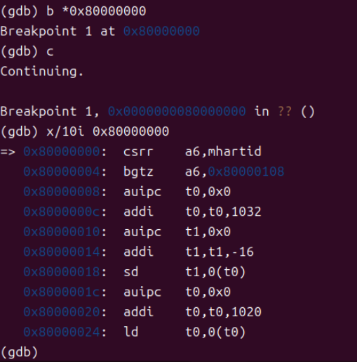

```Plain
0x80000000: csrr    a6, mhartid
0x80000004: bgtz    a6, 0x80000108
0x80000008: auipc   t0, 0x0
0x8000000c: addi    t0, t0, 1032
0x80000010: auipc   t1, 0x0
0x80000014: addi    t1, t1, -16
0x80000018: sd      t1, 0(t0)
0x8000001c: auipc   t0, 0x0
0x80000020: addi    t0, t0, 1020
0x80000024: ld      t0, 0(t0)
```

**分析：**

- 这是OpenSBI的入口点
- `csrr a6, nhartid`：读取硬件线程数量到`a6`寄存器，用于判断系统是否为多核环境
- `bgtz a6, 0x80000108`：如果硬件线程数大于0，跳转到多核处理代码
- 后续指令在进行OpenSBI的初始化工作，包括设置异常处理、加载某些启动参数或配置信息等


#### 4.跟踪异常向量表设置

查阅资料得知，OpenSBI 需要设置异常向量表，让我们找到这个过程。

```Plain
# 查找 mtvec CSR 的设置
(gdb) watch $mtvec
(gdb) c
```

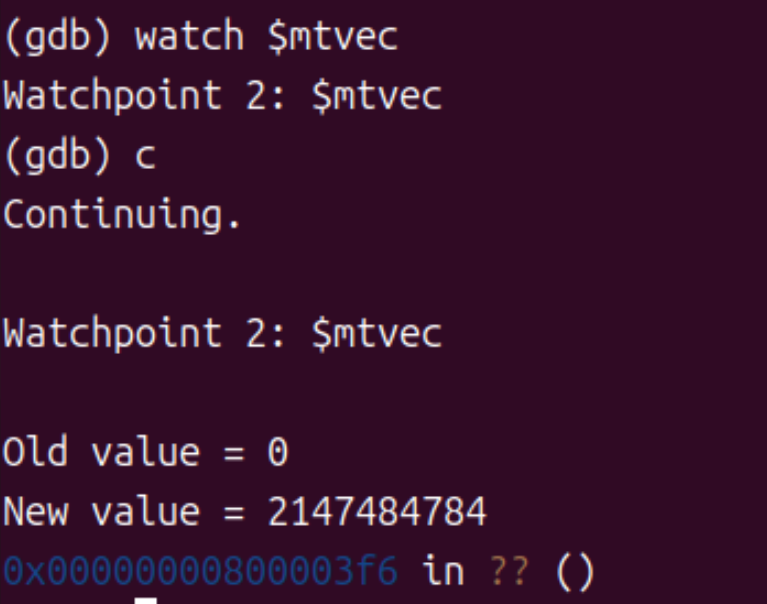

我们发现输入c之后，continue了一会儿才输出，原因是watchpoint会显著影响速度。

可见向量表地址在此时发生修改：

- Old value = 0 ：mtvec 寄存器初始值为 0（未设置异常向量）
- New value = 2147484784 ：这是新的异常向量表地址的十进制表示
- New value的十六进制值 = **0x80000470** ：将New value转成十六进制，这就是新的异常向量表的地址
- 0x00000000800003f6：GDB 当前停下的位置

证明异常**异常处理程序发生了迁移**，新地址位于 OpenSBI 代码段内偏移 1008 字节处。

我们向前查看当前停下位置附近的指令

```Plain
(gdb) x/10i 0x800003e2
```

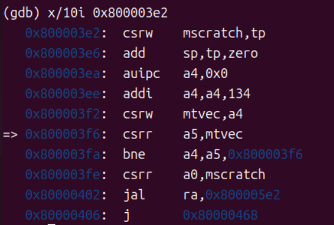

在这段指令中，CPU 首先通过 `auipc a4,0x0` 将当前 PC 的高位加到寄存器 `a4` 中，再通过 `addi a4,a4,134` 为 `a4` 加上偏移量，得到异常向量入口地址：`a4 = 0x800003ea + 134 = 0x800003ea + 0x86 = 0x80000470`（十六进制）。

随后执行 `csrw mtvec,a4` 将该地址写入机器模式的 `mtvec` 寄存器，从而完成异常/中断入口地址的设置，使 CPU 在发生异常或中断时能够跳转到正确的处理程序。

综上，一开始 CPU 上电复位后，mtvec 默认值是 0 。**而当 OpenSBI 启动时，它会很早就设置 mtvec，让所有异常/中断都跳转到 OpenSBI 的异常处理程序。当 OpenSBI 把控制权交给内核时，内核会重新设置 mtvec，指向自己的异常处理函数。**


#### 5. 内核入口点分析

接着我们可以在GDB中输入`break kern_entry`命令，在内核入口函数`kern_entry`的第一条指令处设置第二个断点，系统确认该断点设置在地址`0x80200000`，对应源码文件`kern/init/entry.S`的第7行；

为了验证入口点的代码内容，我们使用`x/10i 0x80200000`命令查看从该地址开始的10条汇编指令，这样可以直观地看到内核启动时最初执行的机器指令序列。

**观察结果：**

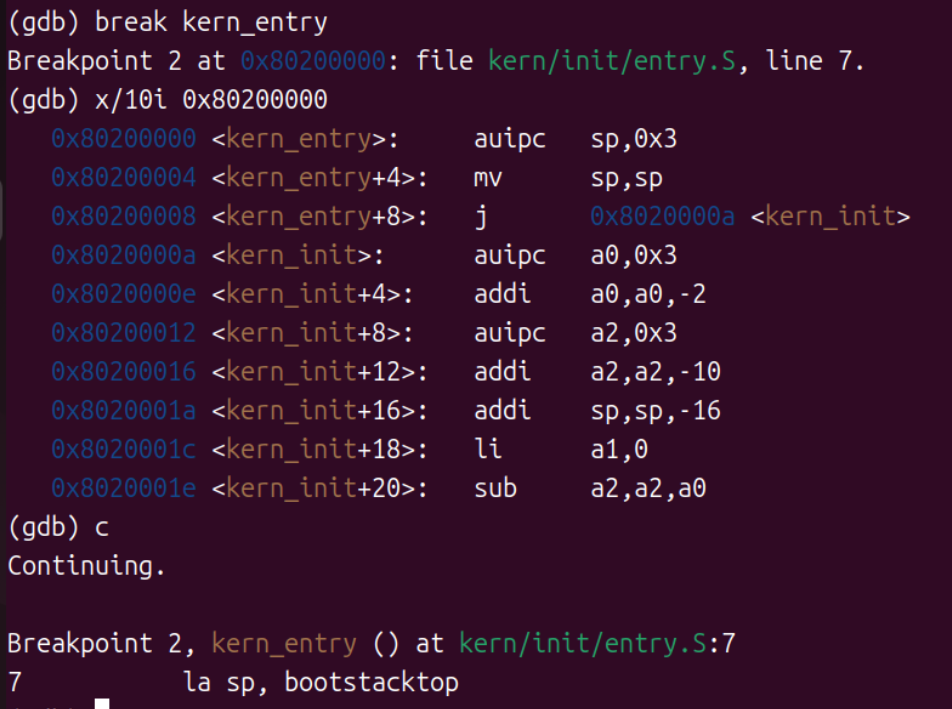

```Plain
0x80200000 <kern_entry>:    auipc    sp, 0x3
0x80200004 <kern_entry+4>:  mv       sp, sp
0x80200008 <kern_entry+8>:  j        0x802000aa <kern_init>
0x802000aa <kern_init>:     auipc    a0, 0x3
0x802000ae <kern_init+4>:   addi     a0, a0, -2
0x80200012 <kern_init+8>:   auipc    a2, 0x3
0x80200016 <kern_init+12>:  addi     a2, a2, -10
0x8020001a <kern_init+16>:  addi     sp, sp, -16
0x8020001c <kern_init+18>:  li       a1, 0
0x8020001e <kern_init+20>:  sub      a2, a2, a0
```

**分析：**

- `kern_entry`是内核的入口点，位于`0x80200000`
- 前两条指令设置栈指针(`sp`)，为内核代码执行分配栈空间
- 第三条指令直接跳转到`kern_init`函数，这表明内核启动流程非常直接，没有复杂的引导代码

当我们执行到地址`0x80200000`的内核入口点时，此时切换到QEMU运行窗口，就可以观察到OpenSBI已经完成启动过程并成功将控制权移交给了操作系统内核，屏幕上会显示OpenSBI的版本信息和启动日志，随后输出内核的初始运行信息，这清楚地表明系统引导流程已顺利从固件阶段进入到了内核执行阶段。

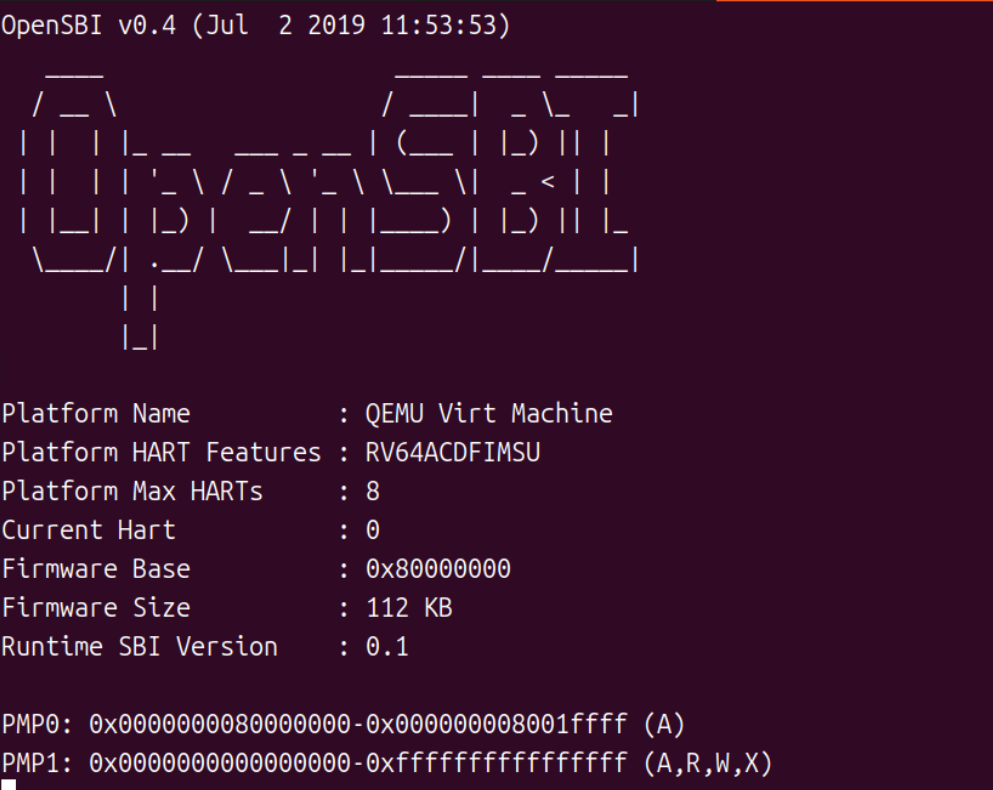

在 `kern_entry` 处停下后，我们还可以输入 `x/10x $sp`命令来查看栈初始化的结果，如下所示：


由于我们此时还并没有开始对栈进行操作，所以此时栈中的内容很可能是一些垃圾数据。

而后我们可以继续用`si`命令来进行单步执行，以此来查看栈的变化：

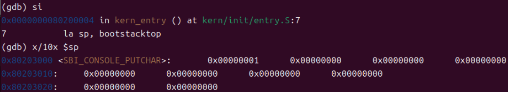

我们执行的这条`auipc sp, 0x3`指令通过将立即数0x3左移12位后与当前PC值相加，计算出内核栈的初始地址并存入栈指针寄存器sp，从而为内核建立起第一个可用的栈空间，使得后续的C语言函数调用得以正常执行。通过 `x/10x $sp`命令来查看的结果也可以看出我们的栈已被初始化。


#### 6. 内核初始化函数分析

我们可以通过设置断点` break kern_init `并查看反汇编代码 `disassemble kern_init `，分析其内核的初始化过程。从反汇编结果可以看出，`kern_init` 函数实现了内核启动的核心初始化逻辑。

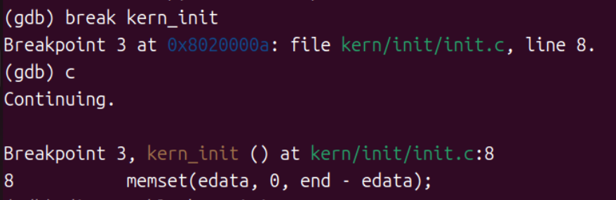

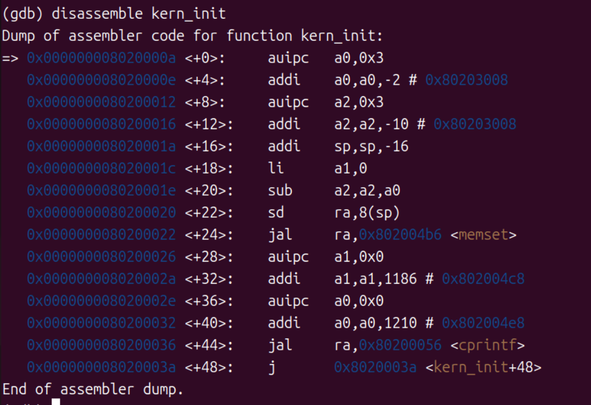

```Plain
=> 0x000000008020000a <+0>:    auipc    a0, 0x3      # 计算BSS段起始地址
   0x000000008020000e <+4>:    addi     a0, a0, -2   
   0x0000000080200012 <+8>:    auipc    a2, 0x3      # 计算BSS段结束地址 
   0x0000000080200016 <+12>:   addi     a2, a2, -10  
   0x000000008020001a <+16>:   addi     sp, sp, -16   # 分配栈空间
   0x000000008020001c <+18>:   li       a1, 0         # 设置清零值
   0x000000008020001e <+20>:   sub      a2, a2, a0    # 计算 BSS 段大小
   0x0000000080200020 <+22>:   sd       ra, 8(sp)     # 保存返回地址
   0x0000000080200022 <+24>:   jal      ra, 0x802004b6 <memset>  # 清零 BSS 段
   0x0000000080200026 <+28>:   auipc    a1, 0x0       # 准备输出字符串地址
   0x000000008020002a <+32>:   addi     a1, a1, 1186  
   0x000000008020002e <+36>:   auipc    a0, 0x0       # 准备格式字符串地址
   0x0000000080200032 <+40>:   addi     a0, a0, 1210  
   0x0000000080200036 <+44>:   jal      ra, 0x80200056 <cprintf>  # 输出启动信息
   0x000000008020003a <+48>:   j        0x8020003a <kern_init+48> # 进入空闲循环
```

**分析：**

kern_init 函数的执行流程体现了操作系统内核启动的标准步骤。首先通过地址计算**确定 BSS 段（未初始化的全局变量和静态变量）的范围**，这是 C 语言运行时环境建立的重要步骤，确保所有未初始化的全局变量和静态变量都被正确清零。随后调用 memset 函数**完成 BSS 段的清零操作**，为后续的内核代码执行提供了干净的内存环境。

在完成基础的内存初始化后，内核准备并**调用 cprintf 函数输出启动信息**，这通常是内核向用户显示的第一条消息。最后，函数通过无条件跳转指令**进入无限循环**，表明在这是一个简化的内核实现，初始化完成后系统进入空闲等待状态。


#### 7. 最终执行状态

我们可以输入`c`命令，继续执行程序。

**观察结果：**

程序在`kern_init`的最后一条指令处进入无限循环，停留在当前状态没有新的输出信息。


此时切换到QEMU运行窗口，出现了下列这段话，这个输出是由kern_init中的cprintf调用产生的。


### （四）问题回答

#### 1.RISC-V硬件加电后最初执行的几条指令位于什么地址？

RISC-V硬件加电后最初执行的指令位于地址**0x1000** ，这是RISC-V架构规定的复位向量地址。

因此，RISC-V 硬件上电后最初执行的几条引导指令均位于 **0x1000 至 0x1010** 范围内

#### 2.这些指令主要完成了哪些功能？

复位地址(0x1000)处的指令主要完成以下功能：

1. **基础环境搭建**：通过`auipc`指令计算相关地址，为后续操作构建基础地址环境
2. **硬件信息获取**：使用`csrr`指令读取当前硬件线程ID，获取硬件基本信息
3. **引导流程跳转**：加载下一阶段引导程序的地址并跳转执行，实现从硬件复位到更高级引导阶段的过渡
4. **多核处理准备**：检查硬件线程数量，为可能的多个处理核心做准备

这些指令构成了最基础的引导加载程序，负责从硬件复位状态过渡到更复杂的引导环境（如OpenSBI）。


### （五）实验总结

通过本次实验，深入理解了RISC-V系统的启动流程：

1. **复位阶段**：从0x1000地址开始执行最基本的硬件初始化，完成硬件线程ID读取等基础操作。
2. **OpenSBI阶段**：在0x80000000地址处，OpenSBI完成更复杂的系统初始化，包括多核处理准备，异常处理设置等。
3. **内核加载阶段**：OpenSBI将控制权转移到内核入口点0x80200000，内核开始执行入口代码。
4. **内核初始化阶段**：执行`kern_init`函数，完成BSS段清零、信息输出设置等工作，最终进入空闲循环。

整个启动流程体现了清晰的分层设计：硬件初始化→引导程序→操作系统内核，这种设计既保证了系统启动的可靠性，又实现了架构的模块化，便于各部分功能的独立开发与维护。


## 三、实验中重要的知识点及与OS原理的对应关系

### （一）系统启动流程相关

| 实验知识点       | OS 原理知识点 | 含义与关系                                                   | 差异                                                         |
| ---------------- | ------------- | ------------------------------------------------------------ | ------------------------------------------------------------ |
| OpenSBI          | 引导程序      | OpenSBI 是 RISC-V 架构下的特定引导程序，负责多核判断、异常处理设置，并把控制权移交给内核。它正是 OS 原理中“引导程序”的具体实现。 | 原理中的“引导程序”是通用概念，各架构都存在；实验中的 OpenSBI 是 RISC-V 环境下的特定版本，地址和逻辑固定。 |
| 内核入口与初始化 | 内核初始化    | 实验中 kern_entry 设置栈指针，kern_init 清零 BSS 段并输出信息，为内核运行做基础准备。这对应 OS 原理中内核初始化的前期阶段。 | 原理中的内核初始化功能更全面，包括内存、进程、设备管理；实验中只保留了最简核心逻辑，是简化版实现。 |


### （二）内核基础环境构建相关

| 实验知识点 | OS 原理知识点  | 含义与关系                                                   | 差异                                                         |
| ---------- | -------------- | ------------------------------------------------------------ | ------------------------------------------------------------ |
| 内核栈设置 | 进程栈与内核栈 | 实验中 bootstacktop 页对齐并加载到 sp，为 C 代码运行提供栈环境；这正是 OS 原理中“内核栈”的初始化过程。 | 原理中的内核栈是通用概念，强调与进程栈的区别；实验是 ucore 的具体实现，用汇编和对齐操作完成栈初始化。 |
| BSS 段清零 | 程序的内存布局 | 实验中用 memset 将 [edata, end] 范围清零，保证未初始化全局/静态变量为 0；这对应 OS 原理中 BSS 段规范的实际落实。 | 原理中 BSS 段清零是普适规则；实验中通过具体函数调用实现，是该规则在内核启动时的实践。 |


## 四、OS原理中很重要，但在实验中没有对应上的知识点

1. **进程控制块与进程状态管理**：OS 原理中 PCB 是描述进程的核心数据结构，包含进程 ID、状态、上下文等信息，进程状态（就绪、运行、阻塞）的转换是进程调度的基础。实验中未涉及进程创建、PCB 定义及进程状态转换，仅内核初始化后进入空闲循环，无多进程调度场景。
2. **虚拟内存与页表机制**：OS 原理中虚拟内存通过页表将虚拟地址映射到物理地址，实现内存隔离、地址空间扩展等功能，页表的创建、更新、地址翻译是核心操作。实验中虽涉及内存地址（如 0x1000、0x80000000、0x80200000），但未涉及虚拟地址、页表定义及地址映射，仅使用物理地址直接操作内存。
3. **内存分配与回收算法**：OS 原理中内存分配（如首次适应、最佳适应）与回收算法用于管理空闲内存块，为进程或内核分配所需内存。实验中内核栈通过.space KSTACKSIZE静态分配，BSS 段清零是固定地址范围操作，未涉及动态内存分配与回收算法。

4. **设备驱动程序框架**：OS 原理中设备驱动是操作系统与硬件设备的接口，包含设备初始化、数据读写、中断处理等功能，遵循特定的驱动框架（如 Linux 的设备驱动模型）。实验中虽涉及控制台输出（cprintf），但未展示设备驱动的完整实现（如设备注册、中断处理函数定义），仅调用上层输出函数，未深入设备驱动细节。
