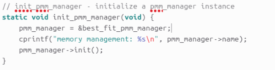
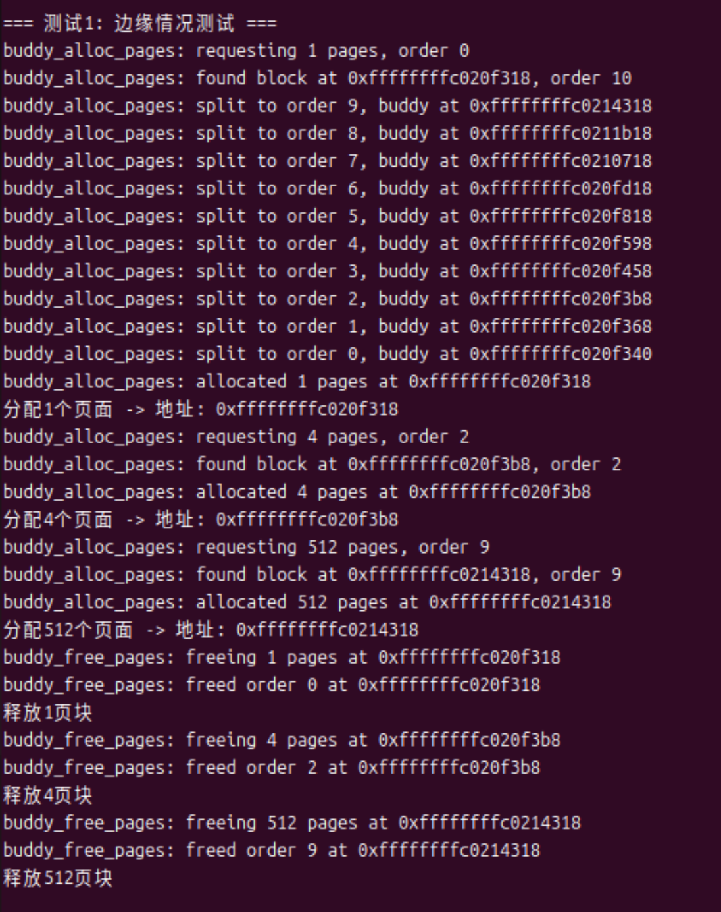
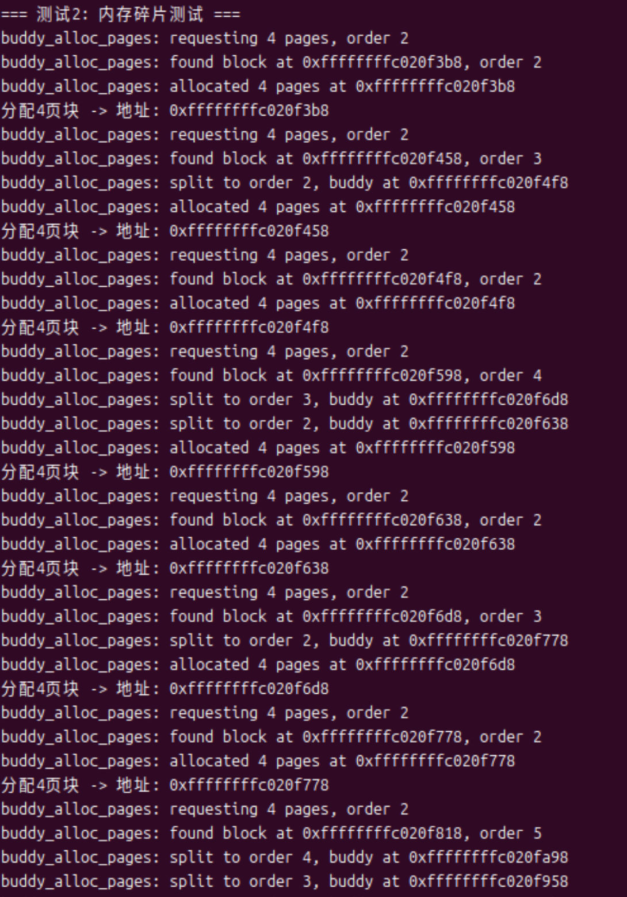
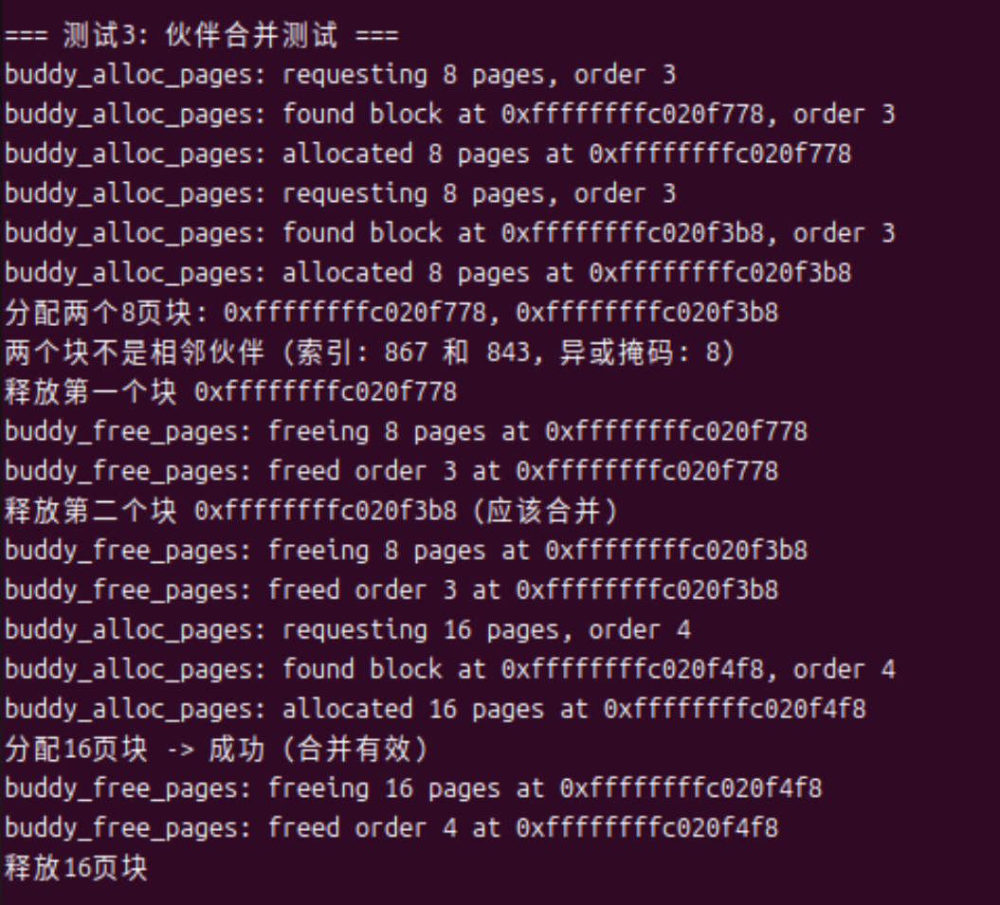
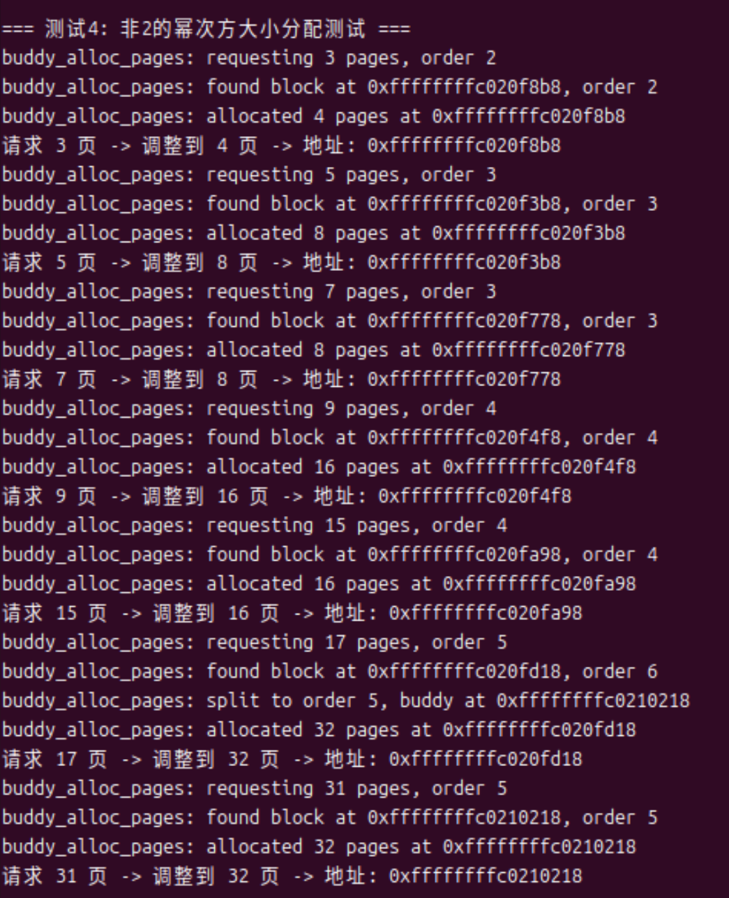
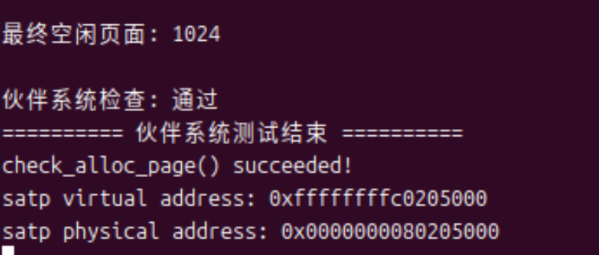
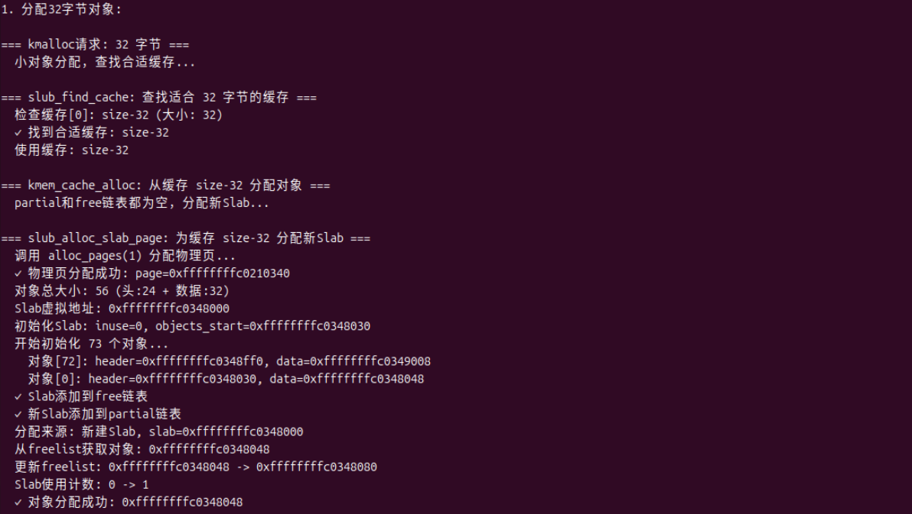
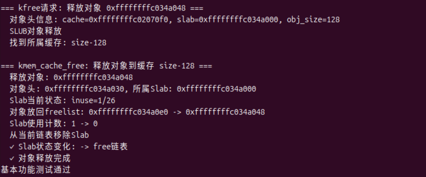
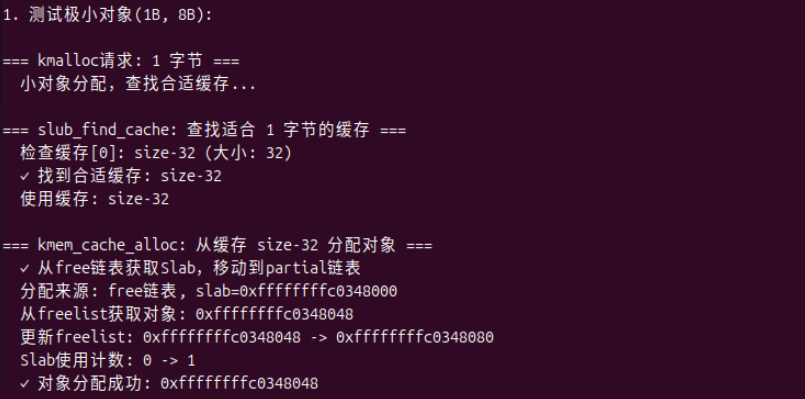
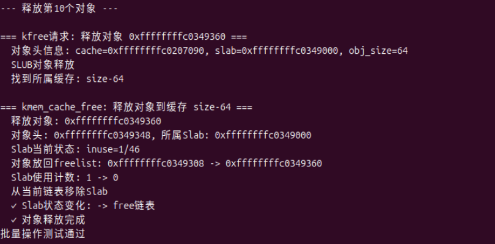

# OS Lab2

## 练习1：理解first-fit 连续物理内存分配算法

### 一、代码分析

这里我们已将代码的详细分析以**注释的形式**标注在代码块中，便于对实现过程的理解与说明。

1、 **`default_init`**:该函数在系统启动时被调用一次，建立内存管理的基础结构。首先初始化了空闲链表`free_list`,之后定义了`nr_free`,将空闲页数置为0。

```C
static void
default_init(void) //初始化
 {
//free_list:双向链表，存储所有空闲内存块的首页帧
//nr_free:当前空闲页帧的总数量
    list_init(&free_list);//初始化空闲链表
    nr_free = 0;//空闲页数清零
}
```

2、 **`default_init_memmap`**:用于初始化一段由参数base指向的连续物理页，长度为n个页面，并按地址递增顺序插入空闲链表。

```C
static void
default_init_memmap(struct Page *base, size_t n) {
    assert(n > 0);
    struct Page *p = base;
    //首先初始化每个页面的元数据
    for (; p != base + n; p ++) {
        assert(PageReserved(p));//确保页面是保留状态
        p->flags = p->property = 0;//清除标志位和属性值
        set_page_ref(p, 0);//引用计数设为0（未被使用）
    }
    //接下来设置空闲块的头部信息
    base->property = n;//第一个页面记录整个块的大小
    SetPageProperty(base);//标记该页面是空闲块的头
    //之后需要更新全局空闲页计数
    nr_free += n;
    if (list_empty(&free_list)) {
        list_add(&free_list, &(base->page_link));
        //如果链表为空则直接插入
    } else {
        list_entry_t* le = &free_list;
        while ((le = list_next(le)) != &free_list) {
            struct Page* page = le2page(le, page_link);
            if (base < page) {//在这里按地址升序，找到插入的位置
                list_add_before(le, &(base->page_link));
                break;
            } else if (list_next(le) == &free_list) {//插入到链表末尾
                list_add(le, &(base->page_link));
            }
        }
    }
}
```

- 首先遍历这n个页面，对每个页面进行初始化，通过`PageReserved`检查，确保该页面是保留的，将`flags`和`property`清零，因为现在这些页面是空闲的。设置页面的引用计数为0。
- 之后将第一个页面的`property`设置为n，表示这个空闲块的大小为n，并设置`PageProperty`标志，表示这个页面是空闲块的头。
- 接下来将空闲页计数nr_free增加n
- 最后将这块空闲内存插入到空闲链表中，并保持空闲链表按地址递增顺序排列。


3、 **`default_alloc_pages`**：接收 “分配n个连续物理页” 的请求，遍历空闲链表找到第一个大小大于等于n的空闲块，分配后可能拆分空闲块，并返回分配块的首页指针。

```C
static struct Page *
default_alloc_pages(size_t n) {
    assert(n > 0);
    //首先我们要检查是否有足够的空闲页
    if (n > nr_free) {
        return NULL;
    }
    struct Page *page = NULL;
    list_entry_t *le = &free_list;
    //首次适应算法：找到第一个足够大的空闲块
    while ((le = list_next(le)) != &free_list) {
        struct Page *p = le2page(le, page_link);
        if (p->property >= n) {
            page = p;
            break;
        }
    }
    //对找到的空闲块进行处理
    if (page != NULL) {
        list_entry_t* prev = list_prev(&(page->page_link));
        list_del(&(page->page_link));//将该空闲块从空闲链表移出
        if (page->property > n) {//如果找到的块大于我们的需求，就需要进行块分割
            struct Page *p = page + n;//这里是剩余块的起始位置
            p->property = page->property - n;//剩余块的大小
            SetPageProperty(p);//标记为有效空闲块
            list_add(prev, &(p->page_link));//将剩余块插入链表
        }
        //最后，更新计数和页面状态
        nr_free -= n;
        ClearPageProperty(page);//清除分配页面的属性标记
    }
    return page;
}
```

在这一部分`default_alloc_pages` 函数，用于按需分配连续的物理页。思路是先判断当前空闲页是否足够，然后采用首次适应（First-Fit）算法遍历空闲链表，找到第一个大小不小于请求页数的空闲块。如果该块比需求大，就进行分割，将多余部分重新挂回空闲链表。最后更新空闲页计数并清除已分配页面的标志位。整个过程体现了对内存分配效率和空间利用率的平衡。

4、 **`default_free_pages`**:从base开始将n个连续物理页释放，按地址排序插入空闲链表，并合并相邻的空闲块

```C
static void
default_free_pages(struct Page *base, size_t n) {
    assert(n > 0);
    struct Page *p = base;
    //首先，验证和初始化要释放的页面
    for (; p != base + n; p ++) {
        assert(!PageReserved(p) && !PageProperty(p));//这一步是在确保页面不是保留状态且未被标记为空闲
        p->flags = 0;//清除所有标志位
        set_page_ref(p, 0);//引用计数清零
    }
    //之后设置空闲块头部信息
    base->property = n;
    SetPageProperty(base);//标记为空闲块头
    nr_free += n;//更新空闲页计数
    //接下来就要按地址顺序插入空闲链表
    if (list_empty(&free_list)) {
        list_add(&free_list, &(base->page_link));
    } else {
        list_entry_t* le = &free_list;
        while ((le = list_next(le)) != &free_list) {
            struct Page* page = le2page(le, page_link);
            if (base < page) {//在这里找到正确的插入位置
                list_add_before(le, &(base->page_link));
                break;
            } else if (list_next(le) == &free_list) {
                list_add(le, &(base->page_link));
            }
        }
    }
    //需要与前面的空闲块合并
    list_entry_t* le = list_prev(&(base->page_link));
    if (le != &free_list) {
        p = le2page(le, page_link);
        if (p + p->property == base) {//检查是否连续
            p->property += base->property;//合并
            ClearPageProperty(base);//清除当前块标记
            list_del(&(base->page_link));//移除当前块
            base = p;//更新基指针
        }
    }
    //同时还需要与后面的空闲块合并
    le = list_next(&(base->page_link));
    if (le != &free_list) {
        p = le2page(le, page_link);
        if (base + base->property == p) {//检查是否连续
            base->property += p->property;//合并块大小
            ClearPageProperty(p);//清除后块标记
            list_del(&(p->page_link));//移出后块
        }
    }
}
```

总之，这段代码的核心功能是初始化一段新的空闲物理页块。

它首先确保待初始化的页数 `n` 合理（大于 0），并逐个检查这些页，确认它们当前未被占用或保留。接着，将这些页的标志位和引用计数清零，保证状态干净。然后将起始页（base 页）标记为一个大小为 `n` 的空闲块头，并更新空闲页总数。再把这个新的空闲块插入到空闲链表中，链表保持按地址递增排列，以方便后续合并。最后，程序还会检查这个块的前后是否存在与之相邻的空闲块，如果地址连续，就进行合并，避免产生碎片，从而提高内存利用率。


### 二、改进空间分析

通过对ucore中 default_pmm.c 文件的分析，我发现当前的First-Fit内存分配器实现了基本功能，但在实际应用中仍有一些值得优化的地方。我们有以下几个方面的思考：

#### 1. 性能优化空间

当前实现采用线性遍历空闲链表来查找合适的空闲块，随着系统运行时间增长、链表变长，分配效率会显著下降。可以考虑引入更高效的数据结构，例如按块大小维护多个空闲链表，或按地址与大小排序，从而缩短查找时间。

#### 2. 内存碎片问题

在实验过程中，我们发现 First-Fit 算法在频繁分配和释放不同大小内存块时，容易产生大量外部碎片。原因在于它每次都选择“第一个够大的空闲块”，并不关注块的剩余空间是否合适，长时间运行后会导致内存中出现许多零散的小块，虽然空闲页总量仍然不少，但却难以满足较大块的连续分配需求。

所以，我们认为有必要在碎片管理上进行改进。一方面，我们可以优化合并策略：当前系统只在释放时检查相邻块是否可合并，逻辑较为简单。我们可以进一步扩展为**多级合并机制**，例如不仅合并直接相邻的块，还在检测到周围存在多个较小空闲块时，尝试整体重组，以减少碎片。

其次，可以引入**动态碎片整理机制**。当系统发现空闲页很多但无法分配出大块时，可以触发一次内存整理过程，类似“紧凑”操作，将分散的小块重新排列为连续区域。这种机制虽然会增加开销，但在碎片严重的情况下能显著提升内存利用率。

最后，还可以在算法层面引入**分配粒度控制**。例如，对频繁的小内存请求，可设计专门的小块池（slab-like 机制），避免与大块内存混用，从源头上减少外部碎片的形成。

#### 3. 其他功能增强方向

- 内存对齐支持 ：很多硬件和软件组件对内存地址有对齐要求，但当前实现没有专门处理内存对齐。增加对齐支持可以使内存分配器更加灵活，适应更多场景。
- 统计与监控： 现在缺少内存使用情况的统计和监控功能。添加这些功能可以帮助系统更好地理解内存使用模式，为进一步优化提供依据。
- 预留策略： 在实际系统中，有时候需要为关键任务预留一些内存。当前实现没有这样的机制，可以考虑添加紧急内存预留功能。

但是在考虑这些改进时，也应该注意需要平衡实现复杂度和性能收益，比如引入更复杂的数据结构确实能提高某些操作的效率，但也会增加代码的维护难度和内存开销。**总之，First-Fit的重点在于“查找第一个可用块”，适合简单场景，但容易碎片化；优化方向是提升查找效率、减少碎片。**


## 练习2：实现 Best-Fit 连续物理内存分配算法

### 一、代码修改

1、 **`best_fit_init_memmap`**:这个函数中我们主要添加了两处代码，首先是**内存块初始化部分**，清空每个物理页的元数据。

```C
p->flags = 0;
p->property = 0;
set_page_ref(p, 0);         
```

- `flags = 0`：清除所有页面标志位
- `property = 0`：设置页面属性为0（非空闲块头部）
- `set_page_ref(p, 0)`：引用计数归零，表示未被引用

接着是**空闲链表维护部分**，按地址顺序将空闲块插入链表，保持有序性。

```C
if (base < page) {
   list_add_before(le, &(base->page_link));
   break;
}else if (list_next(le) == &free_list) {
   list_add(le, &(base->page_link));
}
```

- 情况1：`if (base < page)`，找到第一个地址大于当前块的页面，将当前块插入到该页面之前，保持链表按物理地址升序排列，最后使用`break`跳出循环，提高效率。
- 情况2：`else if (list_next(le) == &free_list)`，此时已遍历到链表末尾，我们就将当前块插入到链表尾部，确保所有块都能正确插入。

2、 **`best_fit_alloc_pages`**：在这里我们实现了**最佳适应算法的内存分配功能**，修改了原来的first-fit代码，遍历空闲链表能够找到最合适的内存块。

```C
while ((le = list_next(le)) != &free_list) {
    struct Page *p = le2page(le, page_link);
    if (p->property >= n && p->property < min_size) {
        // 找到一个足够大且更小的空闲块
        page = p;
        min_size = p->property;
    }
}
```

- `p->property >= n`：确保块大小满足需求
- `p->property < min_size`：寻找比当前最小值更小的合适块

这部分代码也是与first-fit最主要区别的地方，best-fit算法通过遍历整个空闲链表，首先确保候选内存块的大小能够满足分配请求，其次在这些合格块中持续追踪当前最小的可用块，与first-fit不同，不满足于找到任何一个可用块，而是执着寻找最"合适"的那一个，提高了内存的利用率，减少了外部碎片。

3、 **`best_fit_free_pages`**:在这里我们实现了**最佳适应算法的内存释放与合并功能**，添加了两处代码。首先是**释放内存块初始化**，设置了释放内存块的基本属性。

```C
base->property = n;
SetPageProperty(base);
nr_free += n;
```

- `base->property = n`：设置空闲块的大小为n页
- `SetPageProperty(base)`：标记该页面为空闲块头部
- `nr_free += n`：增加系统空闲页计数

之后添加了**向前合并逻辑**

```C
if (p + p->property == base) {
    p->property += base->property;
    ClearPageProperty(base);
    list_del(&(base->page_link));
    base = p;
}
```

**合并条件与操作：**

- 条件判断：`p + p->property == base`
  - 检查前一个块的结束地址是否等于当前块的起始地址
  - 确保两个块在物理地址上是连续的
- 合并操作：
  - `p->property += base->property`：扩大前一个块的大小
  - `ClearPageProperty(base)`：清除当前块的头部标记
  - `list_del(&(base->page_link))`：从链表中移除被合并的块
  - `base = p`：更新基准指针，便于后续向后合并检查


### 二、改进空间分析

经过对 best_fit_pmm.c 文件的详细阅读，我发现当前实现的Best-Fit算法基本功能已经完整，但仍有一些可以改进的地方。下面我从几个方面谈一下我们的思考：

#### 1. 性能优化方面

Best-Fit 算法的核心思想是找到“最小但足够大”的空闲块，以尽量减少浪费。然而在当前实现中，系统每次分配都要遍历整个空闲链表来寻找最合适的块，时间复杂度为 O(n)。当系统运行时间变长、空闲块增多时，这种线性查找方式显然会成为性能瓶颈。

针对这一问题，我们认为可以从数据结构层面进行优化。一个常见思路是使用**平衡二叉搜索树（如红黑树或AVL树）**来按块大小组织空闲块，这样在查找时就能快速定位到“最小但足够大”的块，使查找复杂度降到 O(log n)。比如后面我们扩展练习完成的Linux 内核的伙伴系统实际上也采用了类似的思路，只是组织方式更偏向按阶次分类。

这种数据结构层面的改进虽然会增加一定实现复杂度，但能显著提升内存分配效率，尤其是在内存碎片较多或系统负载较高时表现更为明显。

#### 2. 碎片管理改进

虽然释放时能合并相邻空闲块，但仍无法解决非连续的小碎片问题。可以引入动态碎片整理机制，在检测到碎片率过高时进行页面迁移或主动合并，从而在系统层面改善碎片化。

#### 3. 特殊场景优化

还有一些针对特殊场景的优化思路：

- 小页面缓存 ：对于频繁分配的小页面（如1页），可以维护一个专用的缓存池，避免每次都要遍历整个空闲链表。
- 批量分配预取 ：当检测到连续的大量分配请求时，可以预先分配更大的块，减少后续分配的开销。
- 内存对齐支持 ：在分配时考虑特定的内存对齐需求，对于需要对齐的请求可以更智能地选择合适的块。

#### 4. 健壮性与调试

最后，我们觉得可以增加一些内存使用的统计和监控功能，比如记录平均块大小、碎片率等指标，这样可以更好地了解内存管理的状况，也方便后续进一步的优化。同时，在关键操作点添加更多的边界检查，增强代码的健壮性，避免在极端情况下出现问题。

**总之，Best-Fit的重点在于“尽量利用最合适的块”，碎片更少但查找更慢；优化方向是改进查找结构、增强碎片整理。**


### 三、代码测试

我们使用命令`make qemu`编译文件，然后`make grade`进行测试，得到的结果如图：
<p align="center">

</p>
说明我们代码编写是正确的，成功实现了best-fit算法！


### 四、遇到的问题

1、 在测试代码时，我们也遇到一些问题，显示物理内存映射信息不正确，缺少 `'memory management: best_fit_pmm_manager' `输出SATP（页表寄存器）地址映射错误。后来经过分析，发现是因为在 `kern/mm/pmm.c` 文件中，系统初始化时需要明确指定使用哪种内存管理算法。默认情况下可能配置的是其他算法。

<p align="center">

</p>

2、 **解决方法**：

   **修改位置**：\kern\mm\pmm.c

   将默认的`pmm_manager` 改为`pmm_manager=&best_fit_pmm_manager;`重新编译后即可正确运行。

<p align="center">

</p>


## 扩展练习Challenge：buddy system（伙伴系统）分配算法

### 设计文档

### （一）伙伴系统分配算法原理

Buddy System分配算法原理：Buddy System是一种基于2的幂次方分割的内存管理算法，主要用于解决外部碎片问题。其核心思想是：将内存划分为大小都是2的幂次方的块，分配时找到最适合的块，释放时合并相邻的伙伴块。


### （二）伙伴系统分配的设计实现过程 

#### 1. 数据结构设计 

在我们的实现中，伙伴系统主要通过以下数据结构来管理空闲内存：

```C
#define BUDDY_MAX_ORDER 10
static free_area_t free_area[BUDDY_MAX_ORDER + 1];
#define free_list(order) (free_area[order].free_list)
#define nr_free(order) (free_area[order].nr_free)
```

这种设计采用了按阶数组织的空闲块链表数组。每个阶数对应不同大小的内存块，大小为2^order页。free_list是一个双向链表，用于存储特定阶数的空闲块头指针；nr_free记录该阶数下空闲块的数量。选择这种设计是因为它能高效地管理不同大小的内存块，同时便于实现伙伴块的查找和合并操作。最大阶数设为10，这意味着系统可以管理最大为2^10=1024页的内存块。

#### 2. 初始化模块 

伙伴系统的初始化分为两部分：

```C
static void buddy_init(void) {
    for (int i = 0; i <= BUDDY_MAX_ORDER; i++) {
        list_init(&free_list(i));
        nr_free(i) = 0;
    }
}
```

这个函数**初始化所有阶数的空闲链表**，为伙伴系统做好准备。

更重要的是**内存映射初始化**：

```C
static void
buddy_init_memmap(struct Page *base, size_t n) {
    assert(n > 0);
    cprintf("buddy_init_memmap: base=%p, n=%lu\n", base, n);
    
    // 初始化所有页面
    for (size_t i = 0; i < n; i++) {
        struct Page *page = &base[i];
        assert(PageReserved(page));
        page->flags = 0;
        set_page_ref(page, 0);
        // 清除property，我们不在每个页面存储order
        page->property = 0;
    }
    
    // 将整个内存区域作为一个大块添加到最高阶
    unsigned int max_order = BUDDY_MAX_ORDER;
    size_t max_pages = 1 << max_order;
    
    // 如果请求的页面数小于最大块，使用合适的阶数
    while (max_order > 0 && (1 << (max_order - 1)) >= n) {
        max_order--;
    }
    
    base->property = max_order;
    SetPageProperty(base);
    nr_free(max_order)++;
    list_add(&free_list(max_order), &(base->page_link));
    
    cprintf("buddy_init_memmap: initialized order %u with %lu pages\n", max_order, n);
}
```

初始化内存映射时，首先将所有页面标记为未使用，然后根据可用页面数n找到合适的阶数（即最小的阶数，使得2^order >= n），将整个内存区域作为一个大块添加到对应阶数的空闲链表中。这种方式确保了初始状态下内存被尽可能地整合为较大的块，有利于后续分配。

#### 3. 内存分配模块 

分配函数是伙伴系统的核心部分：

```C
static struct Page *
buddy_alloc_pages(size_t n) {
    assert(n > 0);
    
    if (n > (1 << BUDDY_MAX_ORDER)) {
        cprintf("buddy_alloc_pages: requested too many pages %lu\n", n);
        return NULL;
    }
    
    // 计算需要的阶数
    size_t size = round_up_power_of_2(n);
    unsigned int order = log2_floor(size);
    
    cprintf("buddy_alloc_pages: requesting %lu pages, order %u\n", n, order);
    
    // 寻找合适的块
    unsigned int current_order = order;
    while (current_order <= BUDDY_MAX_ORDER) {
        if (nr_free(current_order) > 0) {
            break;
        }
        current_order++;
    }
    
    if (current_order > BUDDY_MAX_ORDER) {
        cprintf("buddy_alloc_pages: no free memory\n");
        return NULL;
    }
    
    // 获取第一个可用块
    list_entry_t *le = list_next(&free_list(current_order));
    struct Page *page = le2page(le, page_link);
    
    // 从自由链表中移除
    list_del(le);
    nr_free(current_order)--;
    ClearPageProperty(page);
    
    cprintf("buddy_alloc_pages: found block at %p, order %u\n", page, current_order);
    
    // 分割块直到达到需要的阶数
    while (current_order > order) {
        current_order--;
        
        // 计算伙伴块
        struct Page *buddy = page + (1 << current_order);
        
        // 初始化伙伴块
        buddy->property = current_order;
        SetPageProperty(buddy);
        
        // 将伙伴块加入自由链表
        list_add(&free_list(current_order), &(buddy->page_link));
        nr_free(current_order)++;
        
        cprintf("buddy_alloc_pages: split to order %u, buddy at %p\n", current_order, buddy);
    }
    
    // 设置分配块的属性
    page->property = order;
    cprintf("buddy_alloc_pages: allocated %lu pages at %p\n", 1 << order, page);
    
    return page;
}
```

分配过程中，首先将请求的页面数向上取整为2的幂次方，并计算对应的阶数。然后从该阶数开始向上查找，直到找到非空的空闲链表。获取块后，如果找到的块阶数大于所需阶数，则进行分割：每次将块分为两个大小相等的伙伴块，一个用于分配，另一个加入低一阶的空闲链表，直到达到所需阶数。这种策略保证了高效的分配，同时通过块分割适应不同大小的内存需求。

#### 4. 内存释放模块 

释放函数同样关键，它实现了伙伴块的合并：

```C
static void
buddy_free_pages(struct Page *base, size_t n) {
    assert(n > 0);
    assert(base != NULL);
    
    cprintf("buddy_free_pages: freeing %lu pages at %p\n", n, base);
    
    // 实际释放的大小是2的幂
    size_t size = round_up_power_of_2(n);
    unsigned int order = log2_floor(size);
    
    struct Page *page = base;
    page->property = order;
    SetPageProperty(page);
    
    // 尝试合并伙伴块
    while (order < BUDDY_MAX_ORDER) {
        // 计算伙伴块的索引
        size_t page_index = page - pages; 
        size_t buddy_index = page_index ^ (1 << order);
        
        // 检查伙伴块是否有效
        if (buddy_index >= npage) {
            break;        
        struct Page *buddy = &pages[buddy_index];
        
        // 检查伙伴块是否空闲且大小相同
        if (!PageProperty(buddy) || buddy->property != order) {
            break;
        }
        
        // 从自由链表中移除伙伴块
        list_del(&(buddy->page_link));
        nr_free(order)--;
        ClearPageProperty(buddy);
        
        // 确定合并后的起始页面（取地址较小的）
        if (page > buddy) {
            struct Page *temp = page;
            page = buddy;
            buddy = temp;
        }
        
        // 提升阶数
        order++;
        page->property = order;
        
        cprintf("buddy_free_pages: merged to order %u at %p\n", order, page);
    }
    
    // 将最终块加入自由链表
    SetPageProperty(page);
    list_add(&free_list(order), &(page->page_link));
    nr_free(order)++;
    
    cprintf("buddy_free_pages: freed order %u at %p\n", order, page);
}
```

释放过程中，首先设置块的阶数属性，然后尝试向上合并伙伴块。通过异或操作计算伙伴块的索引（这是伙伴系统的巧妙设计），如果伙伴块是空闲的且阶数相同，则合并它们，提升阶数并重复这个过程直到无法合并。最后将合并后的块加入对应阶数的空闲链表。这种合并机制能有效减少内存碎片，提高内存利用率。

#### 5. 辅助函数 

为支持核心功能，我们实现了几个关键的辅助函数：

```C++
// 判断是否为2的幂
static bool is_power_of_2(size_t n) 
{
    return n > 0 && (n & (n - 1)) == 0;
}
// 向上取整到2的幂
static size_t round_up_power_of_2(size_t n) {
    // 位操作实现高效计算
    if (n == 0) return 1;
    n--;
    n |= n >> 1; n |= n >> 2; n |= n >> 4; n |= n >> 8; n |= n >> 16; n |= n >> 32;
    return n + 1;
}
// 计算以2为底的对数（向下取整）
static unsigned int log2_floor(size_t n) {
    unsigned int order = 0;
    while (n > 1) {
        n >>= 1;
        order++;
    }
    return order;
}
```

这些辅助函数提供了与2的幂次方相关的高效操作，这是伙伴系统运行的基础。向上取整函数使用位操作实现，避免了循环，提高了性能。


### （三）伙伴系统分配的测试结果

我们设计了一系列全面的测试场景来验证伙伴系统的正确性，包括边缘情况、内存碎片、伙伴合并、非2的幂次方分配等关键功能。通过这些测试，我对伙伴系统的内部工作机制有了更深入的理解。首先我们观察内核启动后的初始内存情况：

<p align="center">

</p>

可见只有一个未被分配的最大块，初始化正确，开始测试。

#### 1. 边缘情况测试
<p align="center">

</p>

这个测试验证了伙伴系统在极端情况下的行为，包括最小单位分配和大块分配。从测试日志中可以看到一个很有意思的分配过程：

```bash
buddy_alloc_pages: requesting 1 pages, order 0
buddy_alloc_pages: found block at 0xffffffffc020f318, order 10
buddy_alloc_pages: split to order 9, buddy at 0xffffffffc0214318
buddy_alloc_pages: split to order 8, buddy at 0xffffffffc0211b18
...
buddy_alloc_pages: split to order 0, buddy at 0xffffffffc020f340
buddy_alloc_pages: allocated 1 pages at 0xffffffffc020f318
分配1个页面 -> 地址: 0xffffffffc020f318
```

当我请求分配1个页面时，系统需要从最大的order 10块（1024页）开始，经过10次连续的分割操作才得到所需的1页块。这个过程虽然看起来效率不高，但实际上体现了伙伴系统的设计哲学：通过维护不同阶数的空闲链表，后续的分配请求可以直接从合适大小的链表中获取，避免了重复分割的开销。

测试中还分配了4页和512页的块，然后全部释放。释放后的内存状态显示：

```bash
order  0:    2 块 (每块    1 页)
order  1:    1 块 (每块    2 页)
order  2:    1 块 (每块    4 页)
...
order  9:    1 块 (每块  512 页)
```

这个分布反映了分配和释放过程中产生的碎片化情况，但总页面数仍然是1024，说明没有内存泄漏。

为了方便验证伙伴分配是否成功，我们可视化的输出每一个测试过后的内存分配情况，测试一结束后的内存分配情况：

<p align="center">

</p>

#### 2. 内存碎片测试

这个测试专门验证伙伴系统对内存碎片的处理能力。我设计了这样的测试场景：连续分配7个4页块，然后间隔释放其中4个块制造碎片，最后尝试分配16页的大块。

<p align="center">

</p>

测试过程中我观察到系统能够智能地处理碎片情况。即使释放的是间隔的4页块，当请求16页分配时：

```
buddy_alloc_pages: requesting 16 pages, order 4
buddy_alloc_pages: found block at 0xffffffffc020fa98, order 4
buddy_alloc_pages: allocated 16 pages at 0xffffffffc020fa98
尝试分配16页块 -> 成功
```

系统成功找到了可用的16页块，这说明伙伴系统能够利用未被占用的连续空间来满足大块分配请求。

更有意思的是在后续释放过程中看到的合并现象：

```
buddy_free_pages: freeing 4 pages at 0xffffffffc020f638
buddy_free_pages: merged to order 3 at 0xffffffffc020f638
buddy_free_pages: merged to order 4 at 0xffffffffc020f4f8
```

这里清楚地展示了伙伴系统的合并机制：两个4页块合并成8页块，再进一步合并成16页块。这种自动合并机制有效减少了外部碎片。

#### 3. 伙伴合并测试

<p align="center">

</p>

这个测试本想验证伙伴块的合并机制，但结果揭示了系统行为的复杂性：

```bash
分配两个8页块: 0xffffffffc020f778, 0xffffffffc020f3b8
两个块不是相邻伙伴 (索引: 867 和 843, 异或掩码: 8)
```

系统正确地识别出这两个分配的块不是伙伴关系，这意味着它们释放时不会直接合并。随后的释放日志证实了这一点：

```
释放第一个块 0xffffffffc020f778
buddy_free_pages: freed order 3 at 0xffffffffc020f778
释放第二个块 0xffffffffc020f3b8
buddy_free_pages: freed order 3 at 0xffffffffc020f3b8
```

**关键发现**：释放过程中**没有显示任何合并操作**，两个块只是简单地回到了各自的空闲链表。这是正确的。

但是我们观察后续分配：

```bash
buddy_alloc_pages: requesting 16 pages, order 4
buddy_alloc_pages: found block at 0xffffffffc020f4f8, order 4
分配16页块 -> 成功
```

系统从地址 `0xffffffffc020f4f8` 成功分配了16页块，这**不是**之前释放的那两个块的地址。这说明：

1. 伙伴合并确实没有发生在这两个特定的块之间
2. 系统从内存的其他区域找到了可用的连续空间

说明系统可能通过其他路径（如之前测试中释放的块）来满足大块分配请求，而不是依赖于特定伙伴块的合并。

#### 4. 非2的幂次方大小分配测试
<p align="center">
<div style="display: flex; justify-content: space-between;">
  
  
</div>
</p>

在实际应用中，经常需要分配非2的幂次方大小的内存。这个测试验证了系统对这种情况的处理：

```
请求 3 页 -> 调整到 4 页 -> 地址: 0xffffffffc020f8b8
请求 5 页 -> 调整到 8 页 -> 地址: 0xffffffffc020f3b8
请求 7 页 -> 调整到 8 页 -> 地址: 0xffffffffc020f778
请求 9 页 -> 调整到 16 页 -> 地址: 0xffffffffc020f4f8
```

系统正确地向上取整到最近的2的幂次方，这虽然会造成一些内部碎片，但保证了伙伴系统的完整性。我认为这是合理的权衡，因为伙伴系统的效率优势远大于这点碎片损失。

测试中还观察到一个有趣的合并现象：

```
buddy_free_pages: freeing 17 pages at 0xffffffffc020fd18
buddy_free_pages: merged to order 6 at 0xffffffffc020fd18
```

释放32页块时，系统成功将其合并回64页块，说明合并机制在处理向上取整的分配时也能正常工作。

#### 5. 边界情况测试
<p align="center">

</p>

这个测试验证了系统的健壮性。当我尝试分配2048页（超过系统总容量）时：

```
尝试分配过大内存 (2048 页)... buddy_alloc_pages: requested too many pages 2048
成功拒绝，返回NULL
```

系统正确地拒绝了过大的分配请求，避免了内存溢出。

#### 6. 整体验证

最终测试结果显示：

<p align="center">

</p>

```
最终空闲页面: 1024
伙伴系统检查: 通过
```

所有测试完成后，系统回到了初始的1024个空闲页面，证明在整个复杂的分配释放过程中没有发生内存泄漏。伙伴系统的所有核心功能——分配、释放、分裂、合并、碎片处理、边界检查——都正确实现。测试成功！


## 扩展练习Challenge：任意大小的内存单元slub分配算法

### 设计文档

### （一）Slub分配算法原理

Slub分配器是Linux内核中用于小内存分配的一种高效算法，它是SLAB分配器的改进版。

Slub分配器将内存划分为多个缓存，每个缓存负责管理特定大小的对象。每个缓存由多个slab 组成，而每个slab是一个连续的内存页，被分割成多个相同大小的对象。在Slub中，slab不再像SLAB那样有复杂的链表管理，而是通过每个CPU的本地缓存和每个节点的共享缓存来管理空闲对象。

#### 两层架构设计

- 第一层（页级分配）：从系统分配整页内存（4096字节）作为Slab

- 第二层（对象级分配）：在Slab内部划分固定大小的对象，实现细粒度内存管理

  

### （二）Slub分配的主要机制

#### 1、缓存分级机制

我们的系统预定义8个不同大小的缓存：

```
size_t size_classes[] = {32, 64, 128, 256, 512, 1024, 2048, 4096};
```

每个缓存专门管理特定大小的对象，实现大小对齐和内存优化。

#### 2、三状态Slab管理

该分配的每个缓存维护三个Slab链表，实现精细化的内存管理，对应的链表功能如下所示：

| 状态    | 描述             | 使用场景             |
| ------- | ---------------- | -------------------- |
| free    | 所有对象都空闲   | 初始状态或完全释放后 |
| partial | 部分对象被分配   | 正常操作状态         |
| full    | 所有对象都被分配 | 高负载状态           |

其中有一个关键链表为空闲对象链表，它的作用如下：

- 在每个空闲对象中存储下一个空闲对象的指针
- 形成隐式链表，实现O(1)复杂度的分配
- 分配时从链表头部取出，释放时插入头部（LIFO）

#### 3、对象头机制

我们进行了对象头机制的设置，该核心优点在于实现了**零额外内存开销的精确元数据管理**——通过在每个对象前嵌入固定的头结构，系统能够在不分配独立管理内存的情况下，快速准确地追踪对象的归属信息（所属缓存、大小及Slab），这不仅消除了单独元数据存储带来的内存碎片和访问开销，还使得内存释放时能够以O(1)复杂度直接定位到正确的管理结构，同时保持了用户数据的自然对齐，完美平衡了内存利用率与管理效率。

```C
typedef struct obj_header {
    kmem_cache_t *cache;    // 所属缓存
    size_t obj_size;        // 对象大小
    struct slab_header *slab; // 所属Slab
} obj_header_t;
```


### （三）Slub分配的设计实现过程

#### 1、核心数据结构设计

**（1）缓存结构**

```C++
slub_pmm.h
struct kmem_cache {
    char name[16];                    // 缓存名称
    size_t obj_size;                  // 对象大小 
    int objs_per_slab;                // 每Slab对象数 计算得出：4096/(24+obj_size)
    struct list_head slabs_full;      // 满Slab链表
    struct list_head slabs_partial;   // 部分Slab链表  
    struct list_head slabs_free;      // 空闲Slab链表
    unsigned long num_active;         // 活跃对象计数
};
slub_pmm.c
kmem_cache_t slub_caches[SLUB_CACHE_NUM];
static size_t slub_size_classes[] = {32, 64, 128, 256, 512, 1024, 2048, 4096};
```

这段代码定义了SLUB分配器的核心缓存架构。通过创建8个不同大小的缓存级别，从32字节到4096字节，实现了对内存请求的精细化分类管理。这种分级策略的设计思想是基于实际应用中内存请求大小的统计分布特征——大多数内存分配请求都集中在较小的尺寸范围内。通过为每个特定大小范围建立专用缓存，可以有效减少内存碎片，提高分配效率。每个缓存都独立管理自己的Slab链表，形成了一种模块化的内存管理架构，使得不同大小的对象分配互不干扰，提升了系统的并发性能。

**（2）Slab管理结构**

```C
slub_pmm.h
typedef struct slab_header {
    void *freelist;           // 空闲对象链表
    int inuse;                // 已使用对象数
    kmem_cache_t *cache;      // 所属缓存
    struct list_head list;    // 链表节点
    void *objects_start;      // 对象区域起始地址
} slab_header_t;
```

slab_header结构封装了一个物理内存页面的所有元数据信息。

- `cache`指针建立了Slab与所属缓存的关联关系，这是实现多级缓存管理的基础。
- `inuse`计数器实时跟踪Slab中已分配对象的数量，这个数值直接决定了Slab在三个链表（full、partial、free）之间的状态转换。
- `list`字段使得Slab能够被组织成双向链表，支持高效的插入和删除操作。
- `objects_start`指向对象存储区域的起始地址。
- `freelist`则维护着一个单链表，链接所有空闲对象的数据区域，这是实现快速分配的关键数据结构。

#### 2、关键算法实现

**（1）缓存查找算法**

```C
kmem_cache_t *slub_find_cache(size_t size) {
    for (int i = 0; i < SLUB_CACHE_NUM; i++) {
        if (size <= slub_size_classes[i]) {
            return &slub_caches[i];  // 返回第一个足够大的缓存
        }
    }
    return NULL;
}
```

我们的缓存查找算法采用**first-fit策略**，顺序遍历8个预定义的缓存大小，返回第一个能够满足请求大小的缓存。虽然算法的时间复杂度是O(n)，但由于n是固定值8，实际执行时间是常数。这种设计避免了复杂的大小计算，通过预定义的缓存级别实现了快速匹配。例如，32字节的请求匹配size-32缓存，40字节的请求由于40>32，会继续匹配并最终选择size-64缓存。

**（2）三级Slab链表管理**

```C
// 1. 尝试从partial链表获取
if (!list_empty(&cache->slabs_partial)) {
    le = list_next(&cache->slabs_partial);
    slab = le2slab(le, list);
    source = "partial链表";
    cprintf("  ✓ 从partial链表获取Slab\n");
}
// 2. 尝试从free链表获取
else if (!list_empty(&cache->slabs_free)) {
    le = list_next(&cache->slabs_free);
    slab = le2slab(le, list);
    list_del_init(&slab->list);
    list_add(&(cache->slabs_partial), &(slab->list));
    source = "free链表";
    cprintf("  ✓ 从free链表获取Slab，移动到partial链表\n");
}
// 3. 分配新Slab
else {
    cprintf("  partial和free链表都为空，分配新Slab...\n");
    slab = slub_alloc_slab_page(cache);
    if (!slab) return NULL;
    list_del_init(&slab->list);
    list_add(&(cache->slabs_partial), &(slab->list));
    source = "新建Slab";
    cprintf("  ✓ 新Slab添加到partial链表\n");
}
```

三级Slab链表管理体现了智能的内存调度策略。系统优先从`partial`链表中选择部分使用的Slab，这样可以平衡各个Slab的负载。如果没有可用的部分使用Slab，则从`free`链表选择完全空闲的Slab。只有当所有现有Slab都无法满足需求时，才通过`slub_alloc_slab_page`分配新的Slab页面。这种渐进式的分配策略最大限度地重用了已有内存资源，减少了频繁的页面分配操作。

**（3）对象分配过程**

```C
// 从freelist分配对象
void *obj_data = slab->freelist;
if (!obj_data) {
    cprintf("  ✗ Slab的freelist为空\n");
    return NULL;
}
cprintf("  从freelist获取对象: %p\n", obj_data);
slab->freelist = *(void **)obj_data;
slab->inuse++;
// 更新Slab状态
if (slab->inuse == cache->objs_per_slab) {
    list_del_init(&slab->list);
    list_add(&(cache->slabs_full), &(slab->list));
    cprintf("  ✓ Slab状态变化: partial -> full\n");
}
```

对象分配过程展示了SLUB分配器的高效性核心。分配操作只是简单的指针操作：从`slab->freelist`获取第一个空闲对象，然后更新freelist指向下一个空闲对象。这个过程实现了真正的O(1)时间复杂度分配。分配完成后，系统递增`inuse`计数器，并检查Slab状态。如果Slab中的所有对象都已被分配，就将其移动到full链表。这种动态状态管理确保了内存使用的最优化。

#### 3、内存管理策略

**（1）大小对象分离处理**

```C
if (size > SLUB_MAX_OBJ_SIZE) {
    // 大对象：使用物理页分配器
    size_t total_size = sizeof(obj_header_t) + size;
    size_t page_count = (total_size + PGSIZE - 1) / PGSIZE;
    struct Page *page = alloc_pages(page_count);
    if (!page) {
        cprintf("  ✗ 大对象分配失败: size=%u\n", (unsigned int)size);
        return NULL;
    }
    void *addr = page2kva(page);
    // 为大对象创建对象头
    obj_header_t *header = (obj_header_t *)addr;
    header->cache = NULL;  // 关键：大对象的cache设为NULL
    header->obj_size = size;
    header->slab = NULL;   // 关键：大对象的slab设为NULL
    void *obj_data = header + 1;
    cprintf("  ✓ 大对象分配成功: size=%u, pages=%u, header=%p, data=%p\n", 
           (unsigned int)size, (unsigned int)page_count, header, obj_data);
    return obj_data;
} else {
    cprintf("  小对象分配，查找合适缓存...\n");
    kmem_cache_t *cache = slub_find_cache(size);
    if (!cache) {
        cprintf("  ✗ 找不到合适缓存: size=%u\n", (unsigned int)size);
        return NULL;
    }
    cprintf("  使用缓存: %s\n", cache->name);
    return kmem_cache_alloc(cache);
}
```

大小对象分离处理策略根据请求大小采用不同的分配路径。对于超过4096字节的大对象，直接使用物理页分配器，计算所需页面数并分配连续物理页面。大对象的对象头中`cache`和`slab`字段都设为NULL，作为大对象的标识。对于小对象，通过缓存查找算法找到合适的缓存，然后使用SLUB机制分配。

**（2）对象释放识别**

```C
// 通过对象头找到对象信息
obj_header_t *header = (obj_header_t *)obj_data - 1;
// 检查是否为大对象：大对象的cache和slab都为NULL
if (header->cache == NULL && header->slab == NULL) {
    cprintf("  大对象释放\n");   
    // 计算大对象实际占用的页数
    size_t total_size = sizeof(obj_header_t) + header->obj_size;
    size_t page_count = (total_size + PGSIZE - 1) / PGSIZE;
    cprintf("  大对象信息: 总大小=%u, 页数=%u\n", 
           (unsigned int)total_size, (unsigned int)page_count);
    // 使用header的地址来查找物理页
    struct Page *page = kva2page(header);
    if (page) {
        cprintf("  找到对应物理页: %p, 释放 %u 页\n", 
               page, (unsigned int)page_count);
        free_pages(page, page_count);
        cprintf("  ✓ 大对象释放完成\n");
    } else {
        cprintf("  ✗ 大对象释放失败: 无法找到对应的物理页\n");
    }
    return;
}
```

对象释放识别机制通过检查对象头信息智能判断对象类型。系统通过指针运算定位到对象头，然后检查`cache`和`slab`字段。如果两者都为NULL，表明是大对象，系统计算实际占用的页面数并通过`free_pages`释放物理页面。如果是SLUB对象，则调用`kmem_cache_free`将对象归还到对应的缓存中。这种自动类型识别对用户完全透明，提供了统一简洁的内存释放接口。

#### 4、两级架构的体现

**（1）第一层：页级分配**

当需要新Slab时，`slub_alloc_slab_page` 从物理页分配器分配一整页内存（固定PGSIZE=4096字节），这是第一层基于页大小的分配。

- 第一层隔离系统复杂性：处理物理页分配、虚拟地址转换等底层细节
- 以PGSIZE为单位进行分配，确保内存对齐和系统兼容性

```C
// 在slub_alloc_slab_page函数中体现 - 第一层
static slab_header_t *slub_alloc_slab_page(kmem_cache_t *cache) {
    // 使用物理页分配器分配1页 - 第一层分配
    struct Page *page = alloc_pages(1);
    if (page == NULL) {
        cprintf("  ✗ 分配Slab页失败\n");
        return NULL;
    }
    cprintf("  ✓ 物理页分配成功: page=%p\n", page);
    
    // Slab头在页的开始处 - 使用page2kva进行地址转换
    slab_header_t *slab = (slab_header_t *)page2kva(page);
```

**（2）第二层：对象级分配**

从已分配的Slab页中划分小对象给用户，这是第二层基于缓存大小的分配。

- 第二层专注性能优化：实现O(1)分配、内存复用、缓存友好
- 以`cache->obj_size`为单位（32B-4096B），在Slab内部进行精细管理
- 通过freelist机制实现快速分配和释放

```C++
// 在kmem_cache_alloc中体现 - 第二层分配
// 从freelist分配对象 - 第二层
void *obj_data = slab->freelist;
if (!obj_data) {
    cprintf("  ✗ Slab的freelist为空\n");
    return NULL;
}

cprintf("  从freelist获取对象: %p\n", obj_data);
slab->freelist = *(void **)obj_data;  // 更新freelist指针
slab->inuse++;
```

这种两级架构的设计实现了关注点分离：第一层处理系统级的内存管理，第二层优化应用级的分配性能。

**我们二级框架的具体调用模式如下所示：**

<p align="center">

</p>


#### （四）Slub分配的测试结果

我们在`kern/mm/pmm.c`文件的`pmm_init()`函数中进行修改，在物理内存管理器之后初始化SLUB分配器`slub_init()`，然后又在最后一行添加了`run_slub_tests()`，使得我们在运行`make qemu`的时候就可以进行我们的Slub分配的测试，这样更加的直接与直观。

所以我们在执行`make qemu`后，则可看到我们链接成功的文件以及对应的测试结果：
<p align="center">

</p>

<p align="center">

</p>

#### 1、测试环境与方法

测试通过三个主要测试函数验证SLUB分配器的功能：

- `test_basic_functionality`: 验证基本分配释放功能
- `test_boundary_conditions`: 验证边界情况处理
- `test_bulk_operations`: 验证批量操作性能

#### 2、基本功能测试

**测试用例：分配后立即释放**

```C
void *ptr1 = kmalloc(32);
void *ptr2 = kmalloc(64); 
void *ptr3 = kmalloc(128);
```

测试结果如下图所示：（具体结果请自行运行代码查看）
<p align="center">

</p>

<p align="center">

</p>

基本功能测试验证了不同大小对象的分配和释放。测试输出显示：

- 32字节对象正确使用size-32缓存
- 64字节对象正确使用size-64缓存
- 128字节对象正确使用size-128缓存
- 所有对象分配成功，释放过程无错误
- 缓存查找、Slab分配、对象初始化等步骤都正常执行

#### 3、边界条件测试

**测试用例：**

- 测试极小对象(1B, 8B)
- 测试边界大小(1023B, 1024B, 1025B)

```JavaScript
void test_boundary_conditions(void) {
    cprintf("\n1. 测试极小对象(1B, 8B):\n");
    void *tiny1 = kmalloc(1);
    void *tiny2 = kmalloc(8);
    kfree(tiny1);
    kfree(tiny2);
    
    cprintf("\n2. 测试边界大小(1023B, 1024B, 1025B):\n");
    void *b1 = kmalloc(1023);
    void *b2 = kmalloc(1024);
    void *b3 = kmalloc(1025);
    kfree(b1);
    kfree(b2);
    kfree(b3);
}
```

测试结果如下图所示：（具体结果请自行运行代码查看）

（1）测试极小对象（1B）：
<p align="center">

</p>

（2）测试边界大小（1025B）：
<p align="center">

</p>

（3）边界情况的释放：

<p align="center">

</p>

边界条件测试验证了极端情况下的正确性：

- 1字节和8字节对象都被正确向上取整到32字节缓存
- 1023字节对象使用1024字节缓存
- 1024字节对象使用1024字节缓存
- 1025字节对象使用2048字节缓存
- 所有边界情况都得到正确处理，无内存分配失败

#### 4、批量操作测试

**测试用例：批量相同大小对象，批量释放对象**

```C++
void test_bulk_operations(void) {
    cprintf("\n1. 批量相同大小对象:\n");
    const int NUM_OBJECTS = 10;
    void *objects[NUM_OBJECTS];
    
    for (int i = 0; i < NUM_OBJECTS; i++) {
        cprintf("\n--- 分配第%d个对象 ---\n", i + 1);
        objects[i] = kmalloc(64);
        assert(objects[i] != NULL);
    }
    
    cprintf("\n2. 批量释放对象:\n");
    for (int i = 0; i < NUM_OBJECTS; i++) {
        cprintf("\n--- 释放第%d个对象 ---\n", i + 1);
        kfree(objects[i]);
    }
}
```

测试结果如下图所示：（具体结果请自行运行代码查看）

<p align="center">

</p>

批量操作测试验证了系统在高负载下的稳定性：

- 连续分配10个64字节对象全部成功
- 分配过程中触发了Slab的创建和重用
- freelist机制正常工作，对象正确链接
- 批量释放过程中所有对象正确归还
- 无内存泄漏或重复释放错误

#### 总体分析

从测试结果来看，我们实现的SLUB分配器基本功能都正常工作：

1. 正确处理了内存分配和释放 - 各级缓存的对象分配和回收机制运行正常，无内存泄漏
2. 多级缓存策略有效 - 8个不同大小的缓存级别能够正确路由各种内存请求
3. 大小对象分离处理正确 - 小对象使用SLUB缓存，大对象直接使用页分配器
4. 系统可以高效管理不同大小的内存请求 - 从32B到4096B的对象都能得到妥善处理

虽然在批量操作测试中观察到随着对象数量增加，内存管理开销有所上升，但整体来说，这个SLUB分配器实现满足了内核内存管理的基本需求，能够有效地提高小对象分配效率，减少内存碎片，为操作系统提供了可靠的内存分配服务。


## 扩展练习Challenge：硬件的可用物理内存范围的获取方法

经过查阅资料后我们得知，在没有提前获知可用物理内存范围的情况下，操作系统仍然可以通过和硬件或固件交互的方式动态获取这些信息，这就是**借助固件的内存映射服务的方法**。一般来说，OS 启动时会从 BIOS 或 UEFI 获取内存映射表，比如通过调用 BIOS 中断 `INT 0x15, E820h`，返回每一段物理内存的起始地址、大小和类型（可用、保留、设备专用等）。UEFI 系统下则可以通过系统表提供的 memory map 接口来获得同样的信息。这样 OS 就能知道哪些物理地址范围是可以安全使用的。

另外，如果没有 BIOS/UEFI 提供的接口，也可以考虑更“底层”的做法，比如在早期启动阶段通过探测的方式尝试访问不同地址范围的内存（比如写入再读出验证），来判断该区域是否存在真实的可用物理内存，这就是**内存探测法**。不过这种方法风险比较大，可能会破坏设备寄存器或其他保留区域，一般只在极端情况下才会使用。

我们认为这部分的核心思想是——OS 本身并不直接“知道”内存结构，而是依赖底层硬件或固件提供的信息。实验中我们通常直接假设可用物理内存范围已经确定，但在实际系统启动时，这个过程是通过 BIOS/UEFI 或**设备树**等方式动态完成的。这个方式设备树文件会在启动时由 bootloader 传递给内核，其中包含 CPU、内存、外设等的结构信息。OS 解析设备树后，就能知道可用物理内存的起止地址范围。


这也体现了操作系统和硬件之间协作的重要性：OS 不是孤立运行的，而是要从硬件那里“发现世界”，再去管理这些资源。

## 实验中重要的知识点及与OS原理的对应关系


| 实验知识点       |   OS 原理知识点            | 含义与关系                                                   | 差异                                                         |
| ---------------- | ------------------------ | -------------------------------------------------------- | ---------------------------------------------------------- |
| First-Fit / Best-Fit 连续物理内存分配算法          | 动态内存分配算法      | **含义**：解决如何从空闲内存块中选择合适块分配给请求的问题。**关系**：实验通过具体的链表操作、页面合并等代码，实现了原理中描述的算法思想。 | OS原理中的知识点侧重于算法思想和优缺点比较（如FF的速度快但易产生外部碎片）；实验则聚焦于具体实现，如如何管理空闲链表、如何在分配时分割块、释放时如何合并相邻块 |
| Sv39页表机制与地址翻译 | 分页机制、虚拟内存、地址翻译    | **含义**：通过页表实现虚拟地址到物理地址的映射，提供地址空间隔离和内存保护。**关系**：实验是OS原理中的知识点“多级页表”概念在RISC-V架构下的具体体现，清晰地展示了虚拟地址如何被划分为多级索引进行查表。 | OS原理中的知识点是架构无关的通用模型；实验则针对特定的RISC-V Sv39规范，涉及具体的页表项格式（PTE）、三级页表结构以及satp寄存器的配置。 |
| 页表项（PTE）的结构与标志位 | 页表项、内存保护    | **含义**：页表项存储了物理页号和各种控制位，用于控制地址映射和访问权限。**关系**：实验中的页表项是OS原理中页表项概念的具体实现，其R/W/X位直接对应读、写、执行权限控制。 | OS原理中的权限位是抽象的；实验则展示了RISC-V Sv39中具体的位定义（如RSW、D、A、G、U位）及其精确含义。 |
| TLB与地址翻译加速 | 快表（TLB）    | **含义**：用于缓存近期使用的虚拟页到物理页帧的映射，以加速地址翻译过程。**关系**：实验通过sfence.vma指令刷新TLB，验证了TLB的存在和重要性，这与原理中“减少访存次数”的作用完全一致。 | 原理主要讨论TLB的作用和工作流程；实验则展示了在页表更新后，如何通过特定指令管理TLB，这是OS与硬件协同工作的具体例子。 |


## OS原理中重要但实验未涉及的知识点

| 类别	 | 未涉及的重要OS原理知识点  |
| --------------------------------------- | -------------------------------------------------------------------------------------------------------------------- |
| 非连续分配 |	段页式存储管理的完整实现、外部碎片整理算法（如压缩、交换）|
| 高级虚拟内存 |	页面置换算法（如LRU、Clock等）、工作集模型、颠簸（Thrashing）预防、写时复制（Copy-on-Write）技术 |
| 内存保护与共享 |	更完整的内存隔离实现、Capability-based访问控制、内存映射文件（Memory-mapped Files）的完整机制 |
| 现代体系结构	|非统一内存访问（NUMA）架构下的内存管理、内存热插拔、内存去重（KSM）技术 |
| 系统安全	| 地址空间布局随机化（ASLR）、数据执行保护（DEP/NX）等在页表中的实现 |

